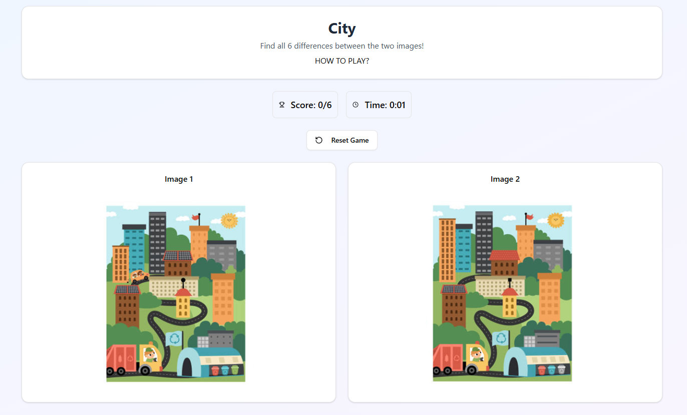

# Spot the Difference Game (React)

A simple "Spot the Difference" game built in React that loads game levels from a JSON configuration. Includes a basic admin screen to update level data using the browser's local storage.

## 🔧 Features

- JSON-based level configuration
- Admin screen to manage game data
- Supports multiple levels with target images and coordinates
- Uses React functional components and routing

---

## 🚀 How to Run the Game

### 1. Clone the Repository

```bash
git clone https://github.com/khushalGrover/SpotDifference-Eklavya-Assessment
cd SpotDifference-Eklavya-Assessment
```

### 2. Install Dependencies

```bash
npm install
or 
yarn install
```

### 3. Start the Development Server

```bash
npm start
or 
yarn dev
```

Your game will be live at [http://localhost:3000](http://localhost:3000) or http://localhost:5173/

---


## 🕹️ How to Play
1. Go to the main page: `/game`
2. Select a level.
3. Click on the image to find the differences.
4. If you click close enough to the predefined difference coordinates, it will be marked as found.
5. Try to find all differences to complete the level.


---

## 🛠️ Admin Panel
Navigate to `/admin` to access the Admin Screen where you can:

- View and edit existing levels
- Add new levels
- Save updates to local storage


Note: Changes are saved only in your browser's local storage and are not persistent across different browsers or devices.

---

## 📁 How JSON Configuration Works

### Default JSON Location:
The default game configuration is stored in `public/game-config.json`.

Example:
```json
{
  "levels": [
    {
      "id": "level1",
      "title": "City Park",
      "image": "/images/level1.jpg",
      "differences": [
        { "x": 120, "y": 80 },
        { "x": 200, "y": 150 }
      ]
    }
  ]
}
```

- **`id`**: Unique identifier for the level
- **`title`**: Level name
- **`image`**: Path to the image file (should be inside `/public/images/`)
- **`differences`**: An array of objects with `x` and `y` coordinates defining the clickable spots

---

## 📦 How Data is Loaded

- On first load, the app fetches `public/game-config.json` as default data.
- After editing in the Admin Screen, data is saved to **`localStorage`** using:
  ```js
  localStorage.setItem('game-config', JSON.stringify(updatedConfig));
  ```
- On subsequent app loads, it first checks `localStorage`. If config exists, it overrides the default file.

---

## 🧼 Resetting to Default

To reset the game config to the default JSON:

1. Open your browser’s DevTools.
2. Go to the **Application > Local Storage** tab.
3. Delete the `game-config` key.
4. Refresh the page.

---

## 🧪 Future Improvements

- Add backend or file saving to persist across devices
- Support user progress saving

